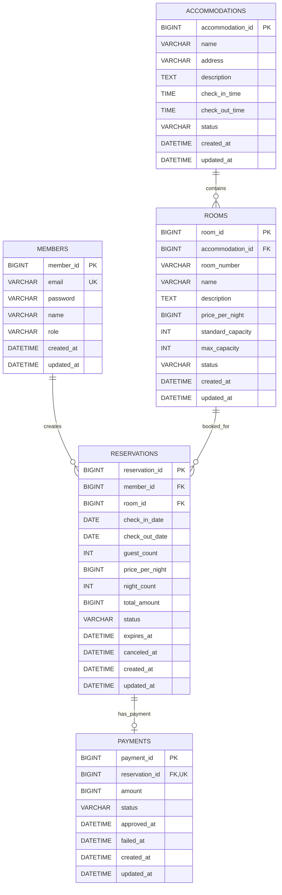

# RoomPick 전체 ERD 초안

- 문서 버전: `v0.3`
- 작성일: 2026-07-21
- 범위: RoomPick MVP 전체 도메인
- 최종 수정일: 2026-07-24
- 포함 도메인: 회원·인증, 숙소, 객실, 예약, 결제
- 제외: 검색, 리뷰, 찜, 쿠폰, 포인트, 채팅, 알림, AI, 별도 환불 이력

---

## 1. 모델링 핵심 결정

1. `ROOM`은 객실 유형이나 수량이 아니라 실제 예약되는 물리적 객실 1개를 나타낸다.
2. 객실 예약 가능 여부는 `RESERVATION`의 날짜 겹침과 상태로 판단한다.
3. 현재 MVP에는 별도의 재고 테이블을 만들지 않는다.
4. 예약 당시 가격을 `RESERVATION`에 스냅샷으로 저장한다.
5. MVP에서는 예약 1건당 결제 1건만 허용하도록 `RESERVATION : PAYMENT`를 `1:1`로 설계한다. 결제 실패 후 새로운 결제 행을 생성하는 재결제 기능은 후속 버전에서 `1:N` 구조로 전환할 때 검토한다.
6. 회원 인증은 JWT로 확정한다. Access/Refresh Token을 발급하되 별도 토큰 테이블은 두지 않는다. 로그아웃은 MVP 이후 JWT + Redis(블랙리스트) 방식으로 구현할 예정이다.
7. 결제 취소는 MVP에서 `PAYMENT.status=REFUNDED`로 관리하고 별도 `REFUND` 테이블은 이후 버전에서 검토한다.
8. 예약·결제 데이터는 거래 이력이므로 숙소나 회원 삭제 시 함께 삭제하지 않는다.

---

## 2. ERD



---

## 3. 관계 정의

| 부모 | 자식 | 관계 | 설명 |
| --- | --- | --- | --- |
| `MEMBERS` | `RESERVATIONS` | 1:N | 회원은 여러 예약을 생성할 수 있다. |
| `ACCOMMODATIONS` | `ROOMS` | 1:N | 숙소는 여러 실제 객실을 가질 수 있다. MVP 시연에는 최소 1개를 등록한다. |
| `ROOMS` | `RESERVATIONS` | 1:N | 객실은 날짜가 겹치지 않는 여러 예약 이력을 가질 수 있다. |
| `RESERVATIONS` | `PAYMENTS` | 1:0..1 | MVP에서는 예약 1건에 결제 정보가 최대 1건 존재하며, `payments.reservation_id`의 Unique Constraint로 보장한다. |

> 예약이 생성된 직후 결제 준비 전에는 Payment가 없을 수 있으므로 물리적으로는 `1:0..1`이며, MVP 정책은 예약당 결제 1건만 허용하는 `1:1` 구조이다.

---

## 4. MEMBERS

회원과 인증에 필요한 최소 정보를 저장한다.

| 컬럼 | 타입 | Null | 키 | 설명 |
| --- | --- | --- | --- | --- |
| `member_id` | `BIGINT` | N | PK | 회원 식별자 |
| `email` | `VARCHAR(255)` | N | UK | 로그인 이메일 |
| `password` | `VARCHAR(255)` | N |  | 암호화된 비밀번호 |
| `name` | `VARCHAR(50)` | N |  | 회원 이름 |
| `role` | `VARCHAR(20)` | N |  | `USER`, `ADMIN`, 기본값 `USER` |
| `created_at` | `DATETIME(6)` | N |  | 생성 시각 |
| `updated_at` | `DATETIME(6)` | N |  | 수정 시각 |

### 제약·인덱스

- `UNIQUE(email)`
- 비밀번호 원문 저장 금지
- 일반 회원가입 요청으로 `ADMIN` 권한을 선택할 수 없음
- 탈퇴 기능 도입 시 물리 삭제보다 상태 컬럼 추가를 검토

---

## 5. ACCOMMODATIONS

객실이 소속된 숙소 정보를 저장한다.

| 컬럼 | 타입 | Null | 키 | 설명 |
| --- | --- | --- | --- | --- |
| `accommodation_id` | `BIGINT` | N | PK | 숙소 식별자 |
| `name` | `VARCHAR(100)` | N |  | 숙소명 |
| `address` | `VARCHAR(255)` | N |  | 숙소 주소 |
| `description` | `TEXT` | Y |  | 숙소 설명 |
| `check_in_time` | `TIME` | N |  | 기본 체크인 시간 |
| `check_out_time` | `TIME` | N |  | 기본 체크아웃 시간 |
| `status` | `VARCHAR(20)` | N |  | `ACTIVE`, `INACTIVE` |
| `created_at` | `DATETIME(6)` | N |  | 생성 시각 |
| `updated_at` | `DATETIME(6)` | N |  | 수정 시각 |

### 정책

- MVP에서는 관리자가 등록한 숙소를 최소 1개 사용하되 개수를 DB에서 강제로 제한하지 않는다.
- 거래 이력 보호를 위해 숙소를 물리 삭제하지 않고 `INACTIVE`로 변경하는 방식을 사용한다.

---

## 6. ROOMS

실제로 예약되는 객실 정보를 저장한다.

| 컬럼 | 타입 | Null | 키 | 설명 |
| --- | --- | --- | --- | --- |
| `room_id` | `BIGINT` | N | PK | 객실 식별자 |
| `accommodation_id` | `BIGINT` | N | FK | 소속 숙소 ID |
| `room_number` | `VARCHAR(30)` | N | UK 조합 | 숙소 내 객실 번호 |
| `name` | `VARCHAR(100)` | N |  | 화면에 표시할 객실명 |
| `description` | `TEXT` | Y |  | 객실 설명 |
| `price_per_night` | `BIGINT` | N |  | 현재 1박 가격, 원 단위 |
| `standard_capacity` | `INT` | N |  | 기준 인원 |
| `max_capacity` | `INT` | N |  | 최대 인원 |
| `status` | `VARCHAR(20)` | N |  | `ACTIVE`, `INACTIVE` |
| `created_at` | `DATETIME(6)` | N |  | 생성 시각 |
| `updated_at` | `DATETIME(6)` | N |  | 수정 시각 |

### 제약·인덱스

- `FK accommodation_id → accommodations.accommodation_id`
- `UNIQUE(accommodation_id, room_number)`
- `price_per_night >= 0`
- `standard_capacity >= 1`
- `max_capacity >= standard_capacity`

### 정책

- MVP에서는 관리자가 등록한 실제 객실을 최소 1개 사용하되 개수를 DB에서 강제로 제한하지 않는다.
- 객실 가격 변경이 과거 예약 금액에 영향을 주지 않도록 예약 생성 시 가격을 복사한다.
- 객실을 운영 중지해도 기존 예약 이력은 유지한다.

---

## 7. RESERVATIONS

회원의 숙박 예약과 예약 당시 가격을 저장한다.

| 컬럼 | 타입 | Null | 키 | 설명 |
| --- | --- | --- | --- | --- |
| `reservation_id` | `BIGINT` | N | PK | 예약 식별자 |
| `member_id` | `BIGINT` | N | FK | 예약 회원 ID |
| `room_id` | `BIGINT` | N | FK | 예약 객실 ID |
| `check_in_date` | `DATE` | N |  | 체크인 날짜 |
| `check_out_date` | `DATE` | N |  | 체크아웃 날짜 |
| `guest_count` | `INT` | N |  | 예약 인원 |
| `price_per_night` | `BIGINT` | N |  | 예약 당시 1박 가격 스냅샷 |
| `night_count` | `INT` | N |  | 숙박 일수 |
| `total_amount` | `BIGINT` | N |  | 최종 예약 금액 스냅샷 |
| `status` | `VARCHAR(30)` | N |  | 예약 상태 |
| `expires_at` | `DATETIME(6)` | Y |  | 결제 대기 만료 시각 |
| `canceled_at` | `DATETIME(6)` | Y |  | 예약 취소 시각 |
| `created_at` | `DATETIME(6)` | N |  | 생성 시각 |
| `updated_at` | `DATETIME(6)` | N |  | 수정 시각 |

### 예약 상태

```text
PENDING_PAYMENT
CONFIRMED
CANCELED
EXPIRED
COMPLETED
```

### 제약·인덱스

- `FK member_id → members.member_id`
- `FK room_id → rooms.room_id`
- 인덱스: `(member_id, created_at)` — 내 예약 목록 최신순 조회
- 인덱스: `(room_id, status, check_in_date, check_out_date)` — 활성 예약 겹침 조회
- `check_in_date < check_out_date`
- `guest_count >= 1`
- `night_count >= 1`
- `price_per_night >= 0`
- `total_amount >= 0`

### 날짜 겹침 규칙

다음 조건을 만족하는 활성 예약이 존재하면 예약할 수 없다.

```text
existing.check_in_date < requested.check_out_date
AND
existing.check_out_date > requested.check_in_date
```

활성 예약:

```text
status = CONFIRMED
OR
(status = PENDING_PAYMENT AND expires_at > CURRENT_TIMESTAMP)
```

### 가격 정합성

```text
night_count = check_out_date - check_in_date
total_amount = price_per_night × night_count
```

DB에 계산 결과를 저장하되 생성 시 Service에서 다시 검증한다.

---

## 8. PAYMENTS

MVP에서 예약별 하나의 결제 정보와 처리 결과를 저장한다.

| 컬럼 | 타입 | Null | 키 | 설명 |
| --- | --- | --- | --- | --- |
| `payment_id` | `BIGINT` | N | PK | 결제 식별자 |
| `reservation_id` | `BIGINT` | N | FK, UK | 결제 대상 예약 ID. 예약당 결제 1건만 허용 |
| `amount` | `BIGINT` | N |  | 예약의 `total_amount`를 복사한 결제 금액 |
| `status` | `VARCHAR(20)` | N |  | 결제 상태 |
| `approved_at` | `DATETIME(6)` | Y |  | Mock 결제 승인 완료 시각 |
| `failed_at` | `DATETIME(6)` | Y |  | Mock 결제 실패 처리 시각 |
| `created_at` | `DATETIME(6)` | N |  | 결제 생성 시각 |
| `updated_at` | `DATETIME(6)` | N |  | 결제 정보 최종 수정 시각 |

### 결제 상태

```text
READY
PAID
FAILED
REFUNDED
```

### 제약·인덱스

- `FK reservation_id → reservations.reservation_id`
- `UNIQUE(reservation_id)` — MVP에서 예약 1건당 결제 1건만 허용
- `CHECK(amount >= 0)` — 음수 결제 금액 방지
- 예약 ID의 Unique Index가 존재하므로 MVP에서는 별도의 `(reservation_id, created_at)` 결제 시도 이력 인덱스를 두지 않는다.

### 정책

- 결제 준비 시 클라이언트 요청 금액이 아니라 `reservations.total_amount`를 Payment에 복사한다.
- 결제 금액은 `reservations.total_amount`와 일치해야 한다.
- MVP에서는 예약과 결제를 `1:1`로 유지하며 결제 실패 후 새로운 Payment 행을 생성하는 재결제 기능을 제공하지 않는다.
- Mock 결제 성공 시 `Payment.status`를 `PAID`, 예약 상태를 `CONFIRMED`로 변경한다.
- Mock 결제 실패 시 `Payment.status`를 `FAILED`, 예약 상태를 `CANCELED`로 변경하여 예약 점유를 해제한다.
- 후속 버전에서 재결제, 결제 수단 변경, PG 재시도 이력이 필요해지면 `payments.reservation_id`의 Unique Constraint를 제거하고 예약 `1` : 결제 `N` 구조로 변경한다.
- 전액 환불은 성공한 결제의 상태를 `REFUNDED`로 변경하며, 부분 환불과 여러 환불 이력이 필요해지면 별도의 `refunds` 테이블을 추가한다.
- 결제 데이터는 감사 이력이므로 물리 삭제하지 않는다.

---

## 9. 삭제·변경 정책

| 대상 | 정책 |
| --- | --- |
| 회원 | 예약 이력이 있으면 물리 삭제하지 않고 추후 상태 기반 탈퇴 처리 검토 |
| 숙소 | 물리 삭제 대신 `INACTIVE` |
| 객실 | 물리 삭제 대신 `INACTIVE` |
| 예약 | 거래 이력이므로 삭제하지 않고 상태 변경 |
| 결제 | 결제·감사 이력이므로 삭제하지 않음 |

외래 키에 무조건 `ON DELETE CASCADE`를 사용하지 않는다.

---

## 10. 담당자별 테이블

| 담당자 | 담당 테이블 |
| --- | --- |
| 임선구 | `accommodations`, `rooms`, `reservations` |
| 조민재(minjae123123) | `payments` |
| 회원·인증 담당자 | `members` |

여러 테이블을 함께 변경하는 유스케이스는 Facade에서 조율하며 다른 담당자의 Repository를 직접 사용하지 않는다.

---

## 11. 버전 확장 시 검토할 테이블

현재 MVP ERD에는 만들지 않는다.

| 이후 기능 | 후보 테이블 |
| --- | --- |
| 별도 환불 이력·부분 환불 | `refunds` |
| 객실 유형별 수량 재고 | `room_types`, `room_daily_inventories` |
| 리뷰 | `reviews` |
| 찜 | `favorites` |
| Refresh Token | `refresh_tokens` 또는 Redis |
| AI 구조화 결과 | `ai_recommendations`, `review_summaries` |
| 프롬프트 외부화·이력 | `prompt_templates`, `prompt_versions` |
| AI 요청 비용·지연 | `ai_usage_logs` 또는 메트릭 저장소 |

---

## 12. 팀 회의에서 최종 확정할 항목

- [x] `ROOM`을 실제 객실 단위로 관리 → 실제 객실 단위로 확정
- [x] 예약과 결제 관계 → MVP는 `1:1`로 확정하고 후속 버전에서만 `1:N` 전환 검토
- [x] 결제 대기 만료 시각 `expires_at` → MVP부터 사용
- [x] JWT 인증 사용 → JWT로 확정. 로그아웃은 추후 JWT + Redis로 구현
- [ ] 최초 관리자 계정을 준비하는 방식을 무엇으로 할지
- [ ] MVP부터 전액 환불을 처리할지
- [x] 숙소·객실을 물리 삭제하지 않는 정책 → `INACTIVE` 상태 변경으로 확정
- [ ] 예약 겹침 동시성 제어에 사용할 락 전략
- [ ] 모든 DB CHECK 제약조건을 마이그레이션에 포함할지

확정된 정책이 변경되면 API 명세, `docs/ERD.md`, `docs/ERD.dbml`, `docs/TABLE_SPEC.md` 및 Flyway 마이그레이션을 함께 갱신한다.
