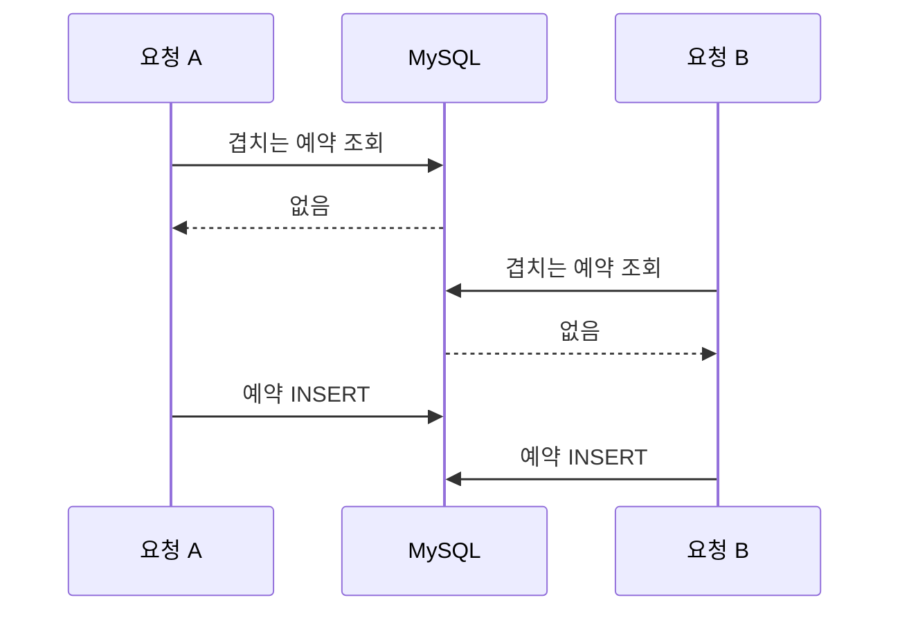
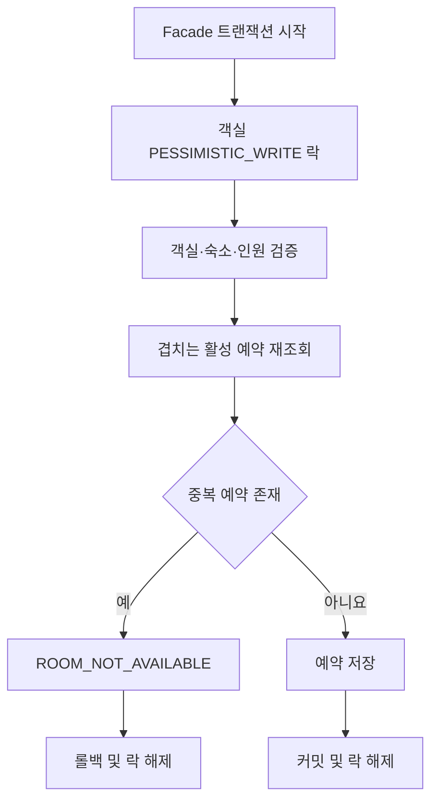
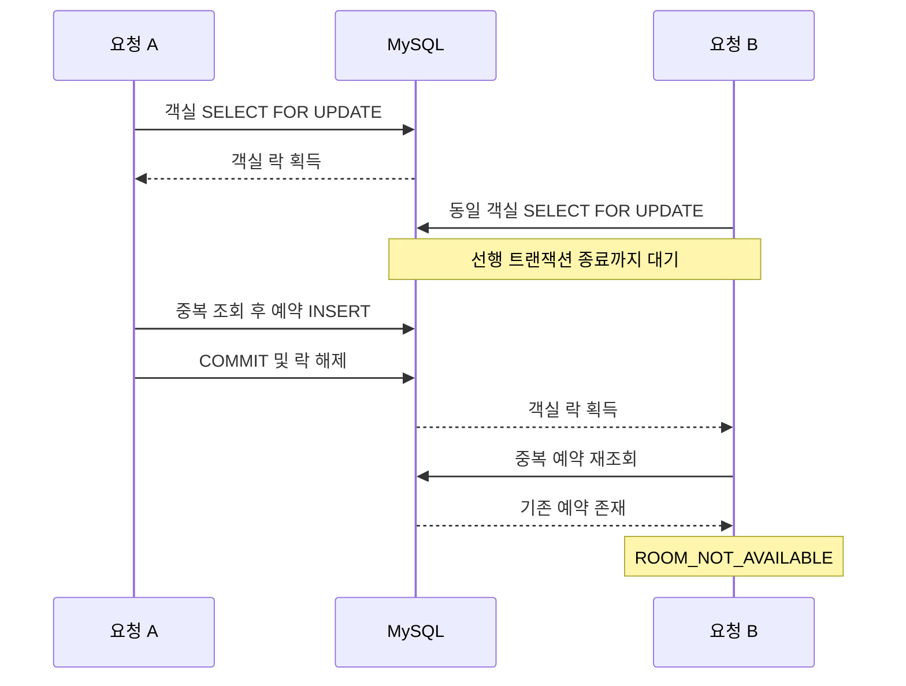

# 예약 생성 동시성 제어

## 1. 목적

서로 다른 회원이 동일한 객실과 겹치는 숙박 기간을 동시에 예약하더라도
활성 예약이 중복 생성되지 않도록 예약 생성 흐름에 동시성 제어를 적용합니다.

예약 가능 여부 조회와 예약 저장 사이에서 발생할 수 있는 Race Condition을
객실 단위 비관적 쓰기 락(`PESSIMISTIC_WRITE`)으로 제어합니다.

이 문서의 범위는 다음과 같습니다.

- 서로 다른 회원의 동일 객실 예약 경합
- 동일 객실의 숙박 기간 중복 검사
- 객실 단위 비관적 락과 트랜잭션 경계
- 락 대기 시간 초과 처리
- 실제 MySQL 통합 테스트 결과

동일 회원의 네트워크 재시도나 버튼 중복 클릭으로 같은 요청이 반복되는 문제는
`Idempotency-Key` 기반 예약 멱등성 이슈에서 별도로 처리합니다.

---

## 2. 문제 상황

기존 예약 생성 로직은 다음 순서로 동작했습니다.

```text
객실 조회
→ 객실·숙소 상태 및 예약 인원 검증
→ 겹치는 활성 예약 조회
→ 예약 저장
```

각 요청을 개별적으로 처리할 때는 문제가 없지만, 서로 다른 트랜잭션이
같은 객실을 동시에 예약하면 두 요청이 모두 중복 검사를 통과할 수 있습니다.



예약 가능 여부를 확인하는 `SELECT`와 예약을 생성하는 `INSERT`가
원자적으로 보호되지 않기 때문에 동일 객실과 기간에 예약 2건이 저장됩니다.

---

## 3. 개선 필요성 검증

실제 MySQL 환경에서 서로 다른 회원 2명이 동일한 객실과 기간을
동시에 예약하도록 `CountDownLatch`로 요청 시작 시점을 맞췄습니다.

동시성 제어 적용 전에는 테스트가 다음 결과로 실패했습니다.

```text
expected: 1L
but was: 2L
```

동일 객실과 기간에는 예약이 1건만 저장되어야 하지만
실제로는 예약 2건이 저장됐습니다.

이는 단순한 단위 테스트 가정이 아니라 실제 MySQL의 서로 다른 Connection과
트랜잭션에서 중복 예약이 생성된다는 것을 보여줍니다.

---

## 4. 해결 전략

### 4.1 객실 단위 비관적 락

예약 생성 시 대상 객실 행을 `PESSIMISTIC_WRITE`로 조회합니다.

```java
@Lock(LockModeType.PESSIMISTIC_WRITE)
@QueryHints(
    @QueryHint(
        name = "jakarta.persistence.lock.timeout",
        value = "3000"
    )
)
@Query("""
    SELECT room
    FROM Room room
    WHERE room.id = :roomId
    """)
Optional<Room> findByIdForUpdate(
    @Param("roomId") Long roomId
);
```

동일 객실에 대한 후속 요청은 선행 트랜잭션이 커밋되거나 롤백되어
객실 락이 해제될 때까지 기다립니다.

락을 획득한 요청만 중복 예약 조회와 예약 저장을 진행하므로
다음 요청은 최신 예약 상태를 확인하게 됩니다.

### 4.2 객실만 먼저 잠그는 이유

비관적 락 쿼리에서는 숙소를 `fetch join`하지 않고 객실 행만 조회합니다.

객실의 숙소 연관관계는 트랜잭션 안에서 LAZY 로딩으로 별도 조회합니다.

같은 숙소에 속한 다른 객실까지 불필요하게 락 대기 대상이 되는 것을
막기 위한 의도적인 트레이드오프입니다.

```text
101호 예약 요청 → 101호 객실 행 잠금
102호 예약 요청 → 102호 객실 행 잠금
```

따라서 같은 숙소의 서로 다른 객실 예약은 독립적으로 진행할 수 있습니다.

### 4.3 대안 검토

| 대안 | 적용하지 않은 이유 |
|---|---|
| 애플리케이션 `synchronized` | 다중 인스턴스 환경에서 인스턴스 간 동시성을 제어할 수 없음 |
| 날짜 조합 Unique Constraint | 임의로 겹치는 숙박 기간 전체를 Unique Constraint만으로 표현하기 어려움 |
| Redis 분산 락 | 별도 인프라와 락 소유권·만료·장애 처리 복잡도가 추가됨 |
| 객실 단위 비관적 락 | MySQL 트랜잭션 안에서 현재 예약 생성 흐름을 일관되게 보호할 수 있어 채택 |

---

## 5. 트랜잭션 경계

객실 락은 예약 중복 검사와 예약 저장이 완료될 때까지 유지돼야 합니다.

이를 위해 `ReservationFacade.createReservation()`이
전체 예약 생성 트랜잭션을 시작합니다.

```java
@Transactional
public ReservationCreateResponseDto createReservation(
    Long memberId,
    ReservationCreateRequestDto request
) {
    Room room =
        roomService.findReservableRoomForUpdate(
            request.roomId(),
            request.guestCount()
        );

    Reservation reservation =
        reservationService.createReservation(
            memberId,
            room,
            request.checkInDate(),
            request.checkOutDate(),
            request.guestCount()
        );

    return ReservationCreateResponseDto.from(
        reservation
    );
}
```

트랜잭션 범위는 다음 작업을 모두 포함합니다.

```text
트랜잭션 시작
→ 객실 락 획득
→ 객실·숙소·인원 검증
→ 겹치는 활성 예약 조회
→ 예약 저장
→ 트랜잭션 커밋
→ 객실 락 해제
```

### 5.1 MANDATORY 전파 속성

`RoomService.findReservableRoomForUpdate()`는 독립적으로 호출되지 않고
반드시 기존 트랜잭션에 참여하도록 `MANDATORY` 전파 속성을 사용합니다.

```java
@Transactional(
    propagation = Propagation.MANDATORY
)
public Room findReservableRoomForUpdate(
    Long roomId,
    int guestCount
) {
    // 객실 락 조회와 검증
}
```

트랜잭션이 없는 상태에서 이 메서드를 잘못 호출하면 즉시 실패합니다.

이를 통해 락을 획득한 직후 트랜잭션이 종료되어
예약 저장 전에 락이 해제되는 구현 실수를 방지합니다.

### 5.2 전체 처리 흐름



---

## 6. 숙박 기간 중복 정책

두 예약의 숙박 기간이 겹치는 조건은 다음과 같습니다.

```text
existing.checkInDate < request.checkOutDate
AND
existing.checkOutDate > request.checkInDate
```

체크아웃 날짜와 다음 예약의 체크인 날짜가 같은 경우에는
숙박 기간이 겹치지 않는 것으로 처리합니다.

| 기존 예약 | 신규 예약 | 중복 여부 |
|---|---|---|
| 8월 4일 ~ 8월 6일 | 8월 4일 ~ 8월 6일 | 중복 |
| 8월 4일 ~ 8월 7일 | 8월 6일 ~ 8월 9일 | 일부 중복 |
| 8월 4일 ~ 8월 6일 | 8월 6일 ~ 8월 8일 | 중복 아님 |

락을 나중에 획득한 요청은 선행 예약의 커밋 결과를 확인한 뒤
겹치는 활성 예약이 있으면 `ROOM_NOT_AVAILABLE`로 거절됩니다.

---

## 7. 락 대기 시간 초과 처리

동일 객실에 요청이 집중되면 후속 요청의 락 대기 시간이 증가할 수 있습니다.

무제한 대기나 DB 기본 대기 시간 이후의 일반 500 응답을 방지하기 위해
JPA 락 대기 한도를 3초로 설정했습니다.

```text
jakarta.persistence.lock.timeout = 3000ms
```

Spring이 변환한 `PessimisticLockingFailureException`은
예약 도메인의 `BusinessException`으로 변경합니다.

```java
try {
    room =
        roomRepository
            .findByIdForUpdate(roomId)
            .orElseThrow(() ->
                new BusinessException(
                    ErrorCode.ROOM_NOT_FOUND
                )
            );
} catch (
    PessimisticLockingFailureException exception
) {
    throw new BusinessException(
        ErrorCode.RESERVATION_LOCK_TIMEOUT
    );
}
```

| 상황 | HTTP 상태 | 에러 코드 |
|---|---:|---|
| 락 획득 후 겹치는 활성 예약 발견 | 409 | `ROOM_NOT_AVAILABLE` |
| 객실 락 대기 시간 초과 | 409 | `RESERVATION_LOCK_TIMEOUT` |

락 대기 시간 초과 응답 메시지는 다음과 같습니다.

```text
예약 요청이 많습니다. 잠시 후 다시 시도해주세요.
```

---

## 8. 적용 후 처리 흐름



락을 먼저 획득한 요청이 예약 저장과 커밋을 완료하면
후속 요청이 객실 락을 획득합니다.

후속 요청은 락 획득 후 활성 예약 중복 검사를 다시 실행하기 때문에
선행 요청이 저장한 예약을 확인할 수 있습니다.

---

## 9. 테스트 전략

### 9.1 단위 테스트

`RoomServicePessimisticLockTest`에서 다음 항목을 검증합니다.

- 예약 가능한 객실을 `findByIdForUpdate()`로 조회
- 존재하지 않는 객실의 `ROOM_NOT_FOUND` 처리
- 비활성 객실 및 비활성 숙소 거절
- 예약 인원이 1명 미만이면 `INVALID_GUEST_COUNT` 처리
- 객실 최대 인원 초과 시 `ROOM_CAPACITY_EXCEEDED` 처리
- 락 대기 예외를 `RESERVATION_LOCK_TIMEOUT`으로 변환
- `Propagation.MANDATORY` 설정
- 락 대기 한도 3초 설정

### 9.2 MySQL 통합 테스트

`ReservationConcurrencyMySqlIntegrationTest`는 Testcontainers의
MySQL 8.4를 사용해 다음 시나리오를 검증합니다.

| 시나리오 | 기대 결과 |
|---|---|
| 동일 객실·완전히 동일한 기간 | 1건 성공, 1건 거절 |
| 동일 객실·일부 겹치는 기간 | 1건 성공, 1건 거절 |
| 동일 객실에서 선행 트랜잭션이 락 유지 | 후속 요청 대기 |
| 동일 객실·겹치지 않는 기간 | 2건 모두 성공 |
| 서로 다른 객실 | 서로 대기하지 않고 2건 모두 성공 |
| 예약 생성 중 예외로 롤백 | 다음 요청 정상 진행 |

테스트 클래스에는 `@Transactional`을 적용하지 않습니다.

각 작업 스레드가 서로 다른 Connection과 트랜잭션을 사용해야
실제 경합 상태를 재현할 수 있기 때문입니다.

### 9.3 단위 테스트 실행

Windows PowerShell에서는 다음 명령으로 실행합니다.

```powershell
.\gradlew.bat clean test `
  --tests "com.roompick.domain.room.service.RoomServicePessimisticLockTest" `
  --tests "com.roompick.domain.room.service.RoomServiceTest" `
  --tests "com.roompick.domain.reservation.facade.ReservationFacadeTest"
```

### 9.4 MySQL 통합 테스트 실행

```powershell
.\gradlew.bat clean integrationTest `
  --tests "com.roompick.domain.reservation.facade.ReservationConcurrencyMySqlIntegrationTest"
```

### 9.5 전체 회귀 테스트 실행

```powershell
.\gradlew.bat clean test integrationTest
```

---

## 10. 적용 전후 결과

동일한 MySQL 통합 테스트를 동시성 제어 적용 전후에 실행한 결과입니다.

| 검증 항목 | 적용 전 | 적용 후 |
|---|---|---|
| 동시 예약 요청 수 | 2건 | 2건 |
| 예약 생성 성공 | 2건 | 1건 |
| `ROOM_NOT_AVAILABLE` | 0건 | 1건 |
| 동일 객실·기간 DB 예약 수 | 2건 | 1건 |
| 통합 테스트 | 실패 | 통과 |

적용 전에는 DB 예약 수가 1건이어야 한다는 검증에서
실제 예약 2건이 조회되어 테스트가 실패했습니다.

```text
expected: 1L
but was: 2L
```

적용 후에는 락을 먼저 획득한 요청만 예약 생성에 성공하고,
후속 요청은 최신 예약 상태를 다시 조회한 뒤
`ROOM_NOT_AVAILABLE`로 처리됩니다.

---

## 11. 운영 고려사항

- 동일 객실에 요청이 집중되면 예약 API 응답 시간이 증가할 수 있습니다.
- `RESERVATION_LOCK_TIMEOUT` 발생 횟수를 모니터링해야 합니다.
- 예약 생성 API의 평균 및 상위 백분위 응답 시간을 모니터링해야 합니다.
- 락 범위가 객실 행을 넘어 숙소나 다른 객실로 확대되지 않는지 점검해야 합니다.
- 락 획득 후 외부 API 호출이나 오래 걸리는 작업을 추가하지 않아야 합니다.
- 예약 저장 트랜잭션은 가능한 짧게 유지해야 합니다.
- 운영 DB와 JPA Provider에서 락 타임아웃 힌트가 의도대로 적용되는지 확인해야 합니다.

---

## 12. 제한 사항과 후속 작업

현재 구현은 동일 객실에 대한 서로 다른 예약 요청의 경합을 제어합니다.

다음 문제는 별도 정책과 구현이 필요합니다.

- 동일 회원이 같은 예약 요청을 반복 전송하는 경우
- 네트워크 지연으로 성공 응답을 받지 못해 요청을 재시도하는 경우
- 예약 버튼을 여러 번 클릭해 동일 요청이 중복 전달되는 경우

이 문제들은 `Idempotency-Key`와 회원 ID를 기준으로 최초 처리 결과를 저장하고,
동일 요청에는 기존 결과를 반환하는 예약 멱등성 기능에서 처리합니다.

서로 다른 멱등성 키로 동일 객실을 예약하는 요청은
현재 문서의 객실 단위 동시성 정책에 따라 처리됩니다.

---

## 13. 관련 파일

- `src/main/java/com/roompick/domain/room/repository/RoomRepository.java`
- `src/main/java/com/roompick/domain/room/service/RoomService.java`
- `src/main/java/com/roompick/domain/reservation/facade/ReservationFacade.java`
- `src/main/java/com/roompick/domain/reservation/service/ReservationService.java`
- `src/main/java/com/roompick/global/common/ErrorCode.java`
- `src/test/java/com/roompick/domain/room/service/RoomServicePessimisticLockTest.java`
- `src/test/java/com/roompick/domain/reservation/facade/ReservationConcurrencyMySqlIntegrationTest.java`
