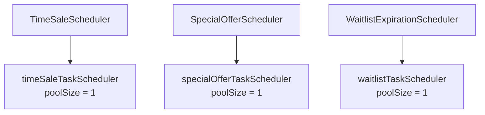

# RoomPick 스케줄러 실행 격리 설계

## 1. 문서 목적

RoomPick의 타임세일, 선착순 특가, 대기열 만료 스케줄러에 각각 독립적인 실행기를 할당하여 하나의 작업이 오래 실행되더라도 다른 스케줄러가 지연되지 않도록 개선합니다.

이 문서는 실행 격리 방법 중 **각 스케줄러에 전용 `ThreadPoolTaskScheduler`를 할당하는 방식**을 다룹니다.

## 2. 적용 대상

| 스케줄러 | 역할 | 실행 주기 |
| --- | --- | --- |
| `TimeSaleScheduler` | 타임세일 시작·종료 상태 반영 | 30초 |
| `SpecialOfferScheduler` | 선착순 특가 시작·종료 상태 반영 | 30초 |
| `WaitlistExpirationScheduler` | 대기열 만료 처리 및 다음 회원 승계 | 10초 |

## 3. 적용 범위

### 포함 범위

- 스케줄러별 전용 `ThreadPoolTaskScheduler` 구성
- 스케줄러별 독립 실행 스레드 사용
- 스케줄러별 스레드 이름 구분
- 같은 스케줄러의 인스턴스 내부 중첩 실행 방지
- 애플리케이션 종료 시 graceful shutdown 적용
- 장시간 작업이 다른 스케줄러를 지연시키지 않는지 검증

### 제외 범위

- 다중 애플리케이션 인스턴스의 중복 실행 방지
- ShedLock 또는 Redis 기반 분산 락
- 스케줄러 비즈니스 로직 변경
- DB 커넥션 풀, Redis, Kafka 등의 자원 격리

> 전용 실행기는 하나의 애플리케이션 인스턴스 내부에서 실행 스레드를 분리하는 방법입니다. 애플리케이션 인스턴스가 여러 개라면 각각의 인스턴스에서 동일한 스케줄러가 실행될 수 있습니다.

## 4. 기존 문제

Spring의 기본 스케줄러 설정에서 여러 스케줄러가 하나의 실행 스레드를 공유하면 먼저 실행된 작업이 종료될 때까지 다른 작업이 대기할 수 있습니다.

예를 들어 `TimeSaleScheduler`가 15초 동안 실행되는 상황에서 `WaitlistExpirationScheduler`의 실행 시각이 도래하면, 대기열 스케줄러는 바로 실행되지 못하고 타임세일 작업이 끝날 때까지 기다릴 수 있습니다.

이로 인해 다음과 같은 문제가 발생합니다.

- 장시간 작업이 다른 스케줄러의 실행을 지연시킵니다.
- 특정 스케줄러의 외부 I/O 또는 DB 지연이 전체 스케줄링 흐름에 영향을 줍니다.
- 모든 작업이 같은 스레드 이름으로 기록되어 로그 분석이 어렵습니다.
- 스케줄러가 추가될수록 공유 실행기의 병목 가능성이 커집니다.

## 5. 목표 구조

각 스케줄러에 풀 크기가 1인 전용 `ThreadPoolTaskScheduler`를 할당합니다.



전체 애플리케이션 관점에서는 세 개의 스레드가 동시에 실행될 수 있으므로 멀티스레드 구조입니다.

다만 각 실행기의 풀 크기는 1이므로 같은 종류의 스케줄러는 해당 실행기 안에서 순차적으로 실행됩니다.

## 6. 실행기 구성

| Bean 이름 | 스레드 이름 접두사 | 풀 크기 | 담당 스케줄러 |
| --- | --- | ---: | --- |
| `timeSaleTaskScheduler` | `timesale-scheduler-` | 1 | `TimeSaleScheduler` |
| `specialOfferTaskScheduler` | `special-offer-scheduler-` | 1 | `SpecialOfferScheduler` |
| `waitlistTaskScheduler` | `waitlist-scheduler-` | 1 | `WaitlistExpirationScheduler` |

각 실행기의 풀 크기를 1로 설정하는 이유는 다음과 같습니다.

- 서로 다른 스케줄러는 동시에 실행할 수 있습니다.
- 같은 종류의 스케줄러는 순차적으로 실행됩니다.
- 동일 작업의 불필요한 중첩 실행을 방지할 수 있습니다.
- 스레드 수와 DB 커넥션 사용량을 예측하기 쉽습니다.

## 7. 구현 방법

### 7.1 전용 실행기 설정

`SchedulerConfig`에 세 개의 `ThreadPoolTaskScheduler` Bean을 등록합니다.

```java
package com.roompick.global.config;

import org.springframework.context.annotation.Bean;
import org.springframework.context.annotation.Configuration;
import org.springframework.scheduling.concurrent.ThreadPoolTaskScheduler;

@Configuration
public class SchedulerConfig {

    public static final String TIME_SALE_SCHEDULER =
        "timeSaleTaskScheduler";

    public static final String SPECIAL_OFFER_SCHEDULER =
        "specialOfferTaskScheduler";

    public static final String WAITLIST_SCHEDULER =
        "waitlistTaskScheduler";

    @Bean(name = TIME_SALE_SCHEDULER)
    public ThreadPoolTaskScheduler timeSaleTaskScheduler() {
        return createScheduler("timesale-scheduler-");
    }

    @Bean(name = SPECIAL_OFFER_SCHEDULER)
    public ThreadPoolTaskScheduler specialOfferTaskScheduler() {
        return createScheduler("special-offer-scheduler-");
    }

    @Bean(name = WAITLIST_SCHEDULER)
    public ThreadPoolTaskScheduler waitlistTaskScheduler() {
        return createScheduler("waitlist-scheduler-");
    }

    private ThreadPoolTaskScheduler createScheduler(
        String threadNamePrefix
    ) {
        ThreadPoolTaskScheduler scheduler =
            new ThreadPoolTaskScheduler();

        scheduler.setPoolSize(1);
        scheduler.setThreadNamePrefix(threadNamePrefix);
        scheduler.setWaitForTasksToCompleteOnShutdown(true);
        scheduler.setAwaitTerminationSeconds(30);
        scheduler.setRemoveOnCancelPolicy(true);

        return scheduler;
    }
}
```

### 7.2 타임세일 스케줄러 연결

```java
@Scheduled(
    fixedDelayString =
        "${timesale.scheduler.fixed-delay-ms:30000}",
    initialDelayString =
        "${timesale.scheduler.initial-delay-ms:30000}",
    scheduler = SchedulerConfig.TIME_SALE_SCHEDULER
)
public void updateTimeSaleStatuses() {
    // 기존 타임세일 처리 로직
}
```

### 7.3 선착순 특가 스케줄러 연결

```java
@Scheduled(
    fixedDelayString =
        "${special-offer.scheduler.fixed-delay-ms:30000}",
    initialDelayString =
        "${special-offer.scheduler.initial-delay-ms:30000}",
    scheduler = SchedulerConfig.SPECIAL_OFFER_SCHEDULER
)
public void updateSpecialOfferStatuses() {
    // 기존 선착순 특가 처리 로직
}
```

### 7.4 대기열 만료 스케줄러 연결

```java
@Scheduled(
    fixedDelayString =
        "${waitlist.scheduler.fixed-delay-ms:10000}",
    initialDelayString =
        "${waitlist.scheduler.initial-delay-ms:10000}",
    scheduler = SchedulerConfig.WAITLIST_SCHEDULER
)
public void expireAndPromoteWaitlists() {
    // 기존 대기열 만료 및 승계 처리 로직
}
```

메서드 이름과 프로퍼티 이름은 실제 프로젝트 코드에 맞게 적용합니다.

## 8. 실행 주기 외부화

`application.yml`에서 스케줄러별 실행 주기와 초기 지연 시간을 관리합니다.

```yaml
timesale:
  scheduler:
    fixed-delay-ms: 30000
    initial-delay-ms: 15000

special-offer:
  scheduler:
    fixed-delay-ms: 30000
    initial-delay-ms: 10000

waitlist:
  scheduler:
    fixed-delay-ms: 10000
    initial-delay-ms: 5000
```

초기 실행 시간을 분산하면 애플리케이션 시작 직후 세 스케줄러의 DB 요청이 동시에 발생하는 것을 줄일 수 있습니다.

기존 실행 시각을 유지해야 한다면 초기 지연 시간은 변경하지 않고 실행기만 분리합니다.

## 9. 적용 후 실행 방식

### 서로 다른 스케줄러

각 스케줄러가 서로 다른 실행기를 사용하므로 동시에 실행할 수 있습니다.

타임세일 작업이 오래 걸리더라도 선착순 특가와 대기열 작업은 각자의 스레드에서 실행됩니다.

### 같은 스케줄러

각 실행기의 풀 크기가 1이고 `fixedDelay`를 사용하면 이전 실행이 끝난 후 설정된 지연 시간이 지나야 다음 작업이 실행됩니다.

따라서 동일한 스케줄러 메서드가 하나의 애플리케이션 인스턴스 안에서 중첩 실행되지 않습니다.

### 예외 발생

한 스케줄러에서 예외가 발생하더라도 다른 전용 실행기의 스레드에는 직접적인 영향을 주지 않습니다.

각 스케줄러에서는 예외를 기록하고 다음 실행 주기가 정상적으로 이어지는지 확인해야 합니다.

### 애플리케이션 종료

다음 설정을 사용하면 애플리케이션 종료 시 실행 중인 작업이 완료될 기회를 얻습니다.

```java
scheduler.setWaitForTasksToCompleteOnShutdown(true);
scheduler.setAwaitTerminationSeconds(30);
```

작업이 30초 안에 종료되지 않으면 애플리케이션 종료가 계속됩니다.

실제 작업의 최대 실행 시간을 고려해 종료 대기 시간을 설정해야 합니다.

## 10. 주의 사항

### 10.1 실행기 분리는 자원 분리가 아닙니다

스케줄러가 서로 다른 스레드에서 실행되더라도 다음 자원은 계속 공유합니다.

- HikariCP DB 커넥션 풀
- MySQL 테이블 및 행 잠금
- Redis 연결
- Kafka 연결
- JVM CPU와 메모리

세 작업이 동시에 많은 데이터를 처리하면 DB 커넥션 사용량이나 락 경합이 증가할 수 있습니다.

실행 격리 적용 후에는 스케줄러 실행 시간뿐만 아니라 DB 커넥션 사용량도 확인해야 합니다.

### 10.2 트랜잭션 경계

스케줄러 클래스는 실행 시점을 제어하는 역할만 담당하고, 실제 상태 변경 트랜잭션은 Service 계층에서 관리합니다.

하나의 스케줄러 실행이 지나치게 긴 트랜잭션을 유지하지 않도록 조회와 변경 범위를 점검해야 합니다.

### 10.3 다중 인스턴스 중복 실행

이 구조는 하나의 JVM 내부에서 스케줄러 간 실행 간섭을 줄이는 방법입니다.

애플리케이션이 두 개 실행되면 각 인스턴스의 스케줄러가 모두 동작합니다.

다중 인스턴스 중복 실행 방지는 별도의 분산 락 작업으로 분리합니다.

## 11. 작업 순서

1. 현재 세 스케줄러의 실행 주기와 사용 스레드 이름을 기록합니다.
2. 장시간 실행되는 가짜 스케줄러를 이용해 기존 실행 지연을 재현합니다.
3. `SchedulerConfig`에 전용 실행기 세 개를 등록합니다.
4. 각 `@Scheduled`에 대응하는 `scheduler` Bean 이름을 지정합니다.
5. 실행 주기와 초기 지연 시간을 설정 파일로 외부화합니다.
6. 로그에서 각 스케줄러의 스레드 이름이 다른지 확인합니다.
7. 하나의 스케줄러가 오래 실행될 때 다른 작업이 정상적으로 시작되는지 검증합니다.
8. 예외 발생 및 애플리케이션 종료 상황을 검증합니다.
9. 스케줄러 관련 테스트를 실행합니다.
10. 커밋 직전에 전체 회귀 테스트를 실행합니다.

## 12. 테스트 계획

### 12.1 실행기 설정 테스트

- `ThreadPoolTaskScheduler` Bean이 세 개 등록되는지 확인합니다.
- 각 실행기의 풀 크기가 1인지 확인합니다.
- 실행기별 스레드 이름 접두사가 구분되는지 확인합니다.

### 12.2 실행 격리 테스트

1. 타임세일 작업이 일정 시간 대기하도록 구성합니다.
2. 타임세일 작업이 종료되기 전에 선착순 특가와 대기열 작업을 실행합니다.
3. 다른 두 작업이 타임세일 작업을 기다리지 않고 실행되는지 확인합니다.
4. 실행 시작 시각과 스레드 이름을 검증합니다.

테스트에서는 `Thread.sleep()`에만 의존하지 않고 다음 도구를 사용하는 것을 권장합니다.

- `CountDownLatch`
- `CyclicBarrier`
- Awaitility

### 12.3 동일 작업 중첩 방지 테스트

- 첫 번째 작업이 종료되지 않은 상태에서 다음 실행 시각이 도래하도록 구성합니다.
- 같은 스케줄러의 동시 실행 수가 1을 넘지 않는지 확인합니다.
- 첫 번째 실행이 끝난 뒤 다음 실행이 정상적으로 이어지는지 확인합니다.

### 12.4 장애 격리 테스트

- 한 스케줄러에서 예외를 발생시킵니다.
- 다른 두 스케줄러가 계속 실행되는지 확인합니다.
- 예외가 발생한 스케줄러도 다음 주기에 다시 실행되는지 확인합니다.

### 12.5 종료 테스트

- 스케줄러 실행 중 애플리케이션 컨텍스트 종료를 요청합니다.
- 설정된 종료 유예 시간 안에서 작업이 정리되는지 확인합니다.
- 애플리케이션이 무한 대기하지 않고 종료되는지 확인합니다.

### 12.6 회귀 테스트

```bash
./gradlew test
```

전체 테스트는 관련 스케줄러 테스트를 먼저 확인한 후 커밋 직전에 실행합니다.

## 13. 로그 확인 예시

실행 격리가 적용되면 스케줄러별 스레드 이름이 다음처럼 구분되어야 합니다.

```text
timesale-scheduler-1
TimeSaleScheduler started

special-offer-scheduler-1
SpecialOfferScheduler started

waitlist-scheduler-1
WaitlistExpirationScheduler started
```

각 스케줄러 로그에는 다음 정보를 포함하는 것이 좋습니다.

- 스케줄러 이름
- 실행 시작 시각
- 실행 종료 시각
- 스레드 이름
- 처리 건수
- 성공 또는 실패 여부
- 실행 소요 시간

## 14. 완료 조건

- [ ] 세 스케줄러가 각각 다른 이름의 실행 스레드에서 동작한다.
- [ ] 타임세일 작업이 오래 실행돼도 선착순 특가와 대기열 작업이 지연되지 않는다.
- [ ] 같은 스케줄러가 하나의 인스턴스 안에서 동시에 실행되지 않는다.
- [ ] 한 스케줄러의 예외가 다른 스케줄러의 실행을 중단시키지 않는다.
- [ ] 애플리케이션 종료 시 실행 중인 작업이 설정된 유예 시간 안에서 정리된다.
- [ ] 실행 주기와 초기 지연 시간을 환경별로 변경할 수 있다.
- [ ] 스케줄러별 스레드 이름과 실행 시간을 로그에서 확인할 수 있다.
- [ ] 스케줄러 관련 테스트가 통과한다.
- [ ] 전체 회귀 테스트가 통과한다.

## 15. 롤백 방법

실행 격리 적용 후 DB 경합이나 커넥션 부족 문제가 발생하면 다음 순서로 롤백합니다.

1. 각 `@Scheduled`의 `scheduler` 속성을 제거합니다.
2. 전용 `ThreadPoolTaskScheduler` Bean을 제거합니다.
3. 실행 주기와 초기 지연 시간을 기존 값으로 복원합니다.
4. 공유 실행기 환경에서 스케줄러가 정상적으로 동작하는지 확인합니다.
5. 전체 회귀 테스트를 실행합니다.

## 16. 참고 자료

- [Spring Framework Scheduling](https://docs.spring.io/spring-framework/reference/integration/scheduling.html)
- [`@Scheduled` Javadoc](https://docs.spring.io/spring-framework/docs/current/javadoc-api/org/springframework/scheduling/annotation/Scheduled.html)
- [`ThreadPoolTaskScheduler` Javadoc](https://docs.spring.io/spring-framework/docs/current/javadoc-api/org/springframework/scheduling/concurrent/ThreadPoolTaskScheduler.html)
