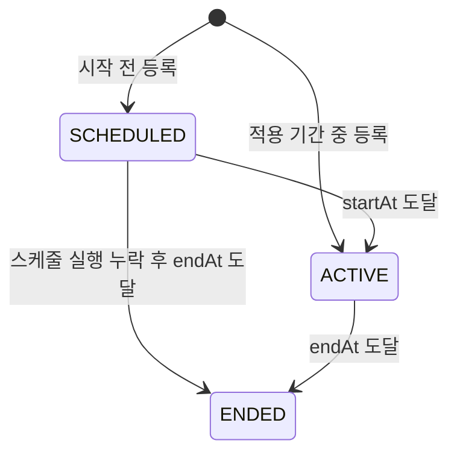
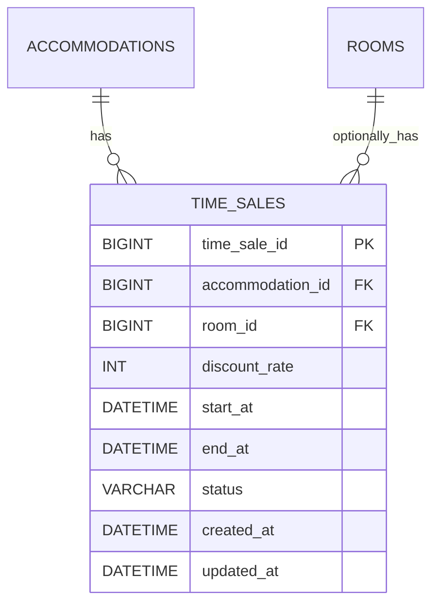

# RoomPick 타임세일 정책 및 구현 문서

- 문서 버전: `v1.0`
- 작성일: 2026-08-13
- 적용 버전: `v2.0`
- 범위: 관리자 타임세일 등록, 할인 가격 계산, 예약 가격 연동, 상태 스케줄링
- 관련 도메인: 숙소, 객실, 예약, 관리자

이 문서는 RoomPick의 숙소 전체 또는 특정 객실에 적용되는 타임세일 정책과 구현 흐름을 정의한다.

타임세일은 현재 시각을 기준으로 객실의 실제 1박 가격을 계산하며, 예약이 생성되면 계산된 가격을 예약에 스냅샷으로 저장한다. 이후 타임세일 상태나 객실 정상 가격이 변경되어도 이미 생성된 예약 금액은 바뀌지 않는다.

---

## 1. 핵심 정책

1. 타임세일은 숙소 전체 또는 특정 객실을 대상으로 등록한다.
2. `roomId`가 없으면 숙소 전체 타임세일이다.
3. `roomId`가 있으면 해당 객실에만 적용되는 객실 전용 타임세일이다.
4. 객실 전용 타임세일과 숙소 전체 타임세일이 모두 적용 가능하면 객실 전용 타임세일을 우선한다.
5. 할인율은 `1%` 이상 `99%` 이하만 허용한다.
6. 시작 시각은 포함하고 종료 시각은 포함하지 않는다.
7. 같은 대상에 기간이 겹치는 타임세일은 등록할 수 없다.
8. 숙소 전체 타임세일과 객실 전용 타임세일은 서로 다른 대상으로 취급하므로 기간이 겹칠 수 있다.
9. 할인 가격 계산 시 소수점 이하는 버린다.
10. 예약 생성 시 적용된 1박 가격과 총액을 예약에 스냅샷으로 저장한다.
11. 스케줄러 상태가 실제 시각보다 늦게 갱신되어도 시작·종료 시각을 함께 검사하여 잘못된 할인이 적용되지 않게 한다.

---

## 2. 타임세일 대상

### 2.1 숙소 전체 타임세일

`time_sales.room_id`가 `NULL`인 타임세일이다.

해당 숙소에 소속된 객실 중 현재 적용 가능한 객실 전용 타임세일이 없는 객실에 적용한다.

```text
accommodation_id = 대상 숙소 ID
room_id = NULL
```

### 2.2 객실 전용 타임세일

`time_sales.room_id`에 객실 ID가 저장된 타임세일이다.

지정한 객실에만 적용하며, 같은 시간에 숙소 전체 타임세일이 존재해도 객실 전용 타임세일을 우선한다.

객실 전용 타임세일을 등록할 때 객실이 요청한 숙소에 실제로 소속되어 있어야 한다.

```text
timeSale.accommodation_id = room.accommodation_id
```

일치하지 않으면 `TIME_SALE_TARGET_MISMATCH` 예외를 반환한다.

---

## 3. 타임세일 상태

| 상태 | 설명 |
| --- | --- |
| `SCHEDULED` | 시작 시각에 도달하지 않은 대기 상태 |
| `ACTIVE` | 시작 시각에 도달했고 종료 시각 전인 활성 상태 |
| `ENDED` | 종료 시각에 도달한 종료 상태 |

### 생성 시 초기 상태

```text
startAt > now
→ SCHEDULED

startAt <= now < endAt
→ ACTIVE
```

종료 시각이 현재 시각과 같거나 이미 지난 타임세일은 새로 등록할 수 없다.

### 상태 전이



`SCHEDULED` 상태에서 활성화 스케줄 실행이 누락된 채 종료 시각에 도달할 수 있으므로, 종료 처리에서는 `SCHEDULED`와 `ACTIVE`를 모두 조회한다.

---

## 4. 기간 정책

### 4.1 유효한 기간

다음 조건을 모두 만족해야 한다.

```text
startAt != null
AND endAt != null
AND now != null
AND endAt > startAt
AND endAt > now
```

조건을 만족하지 않으면 `INVALID_TIME_SALE_PERIOD` 예외를 반환한다.

### 4.2 적용 구간

타임세일은 반개방 구간으로 처리한다.

```text
startAt <= now < endAt
```

- 시작 시각에는 할인을 적용한다.
- 종료 시각에는 할인을 적용하지 않는다.
- `ENDED` 상태는 항상 적용 대상에서 제외한다.

### 4.3 기간 중복 판단

같은 대상을 기준으로 다음 조건을 만족하면 기간이 겹친다.

```text
existing.startAt < requested.endAt
AND existing.endAt > requested.startAt
```

기간이 겹치면 `TIME_SALE_PERIOD_OVERLAP` 예외를 반환한다.

종료 시각과 다음 타임세일의 시작 시각이 같은 경우에는 기간이 겹치지 않는다.

```text
기존 타임세일: 10:00 <= time < 12:00
신규 타임세일: 12:00 <= time < 14:00
→ 등록 가능
```

중복 검사에서는 `ENDED` 상태의 타임세일을 제외한다.

### 4.4 동시 등록 제어

기간 중복 검사는 조회 후 저장하는 방식이므로, 대상 행의 DB 락 없이
동시에 실행하면 두 요청이 모두 중복 없음으로 판단할 수 있다.

이를 방지하기 위해 등록 흐름 전체를 하나의 트랜잭션으로 처리한다.

```text
숙소 전체 타임세일
→ 대상 Accommodation 행 PESSIMISTIC_WRITE 락
→ 기간 중복 검사
→ 타임세일 저장

객실 전용 타임세일
→ 대상 Room 행 PESSIMISTIC_WRITE 락
→ 기간 중복 검사
→ 타임세일 저장
```

같은 숙소 전체 또는 같은 객실의 등록 요청은 직렬화된다. 서로 다른
객실은 서로 다른 행을 잠그므로 동시에 등록할 수 있다.

---

## 5. 할인 가격 계산

### 5.1 적용 우선순위

```text
1. 현재 적용 가능한 객실 전용 타임세일 조회
2. 객실 전용 타임세일이 있으면 해당 할인 적용
3. 없으면 숙소 전체 타임세일 조회
4. 숙소 전체 타임세일이 있으면 해당 할인 적용
5. 둘 다 없으면 객실 정상 가격 반환
```

Repository는 할인율 내림차순, ID 오름차순으로 조회한다.

```text
ORDER BY discount_rate DESC, time_sale_id ASC
```

동일 대상의 기간 중복 등록은 차단하지만, 데이터 정합성 문제나 정책 변경이 발생해 여러 행이 조회되더라도 가장 높은 할인율을 결정적으로 선택한다.

### 5.2 계산식

부동소수점 연산을 사용하지 않고 정수 연산으로 계산한다.

```text
할인 가격 = 정상 1박 가격 × (100 - 할인율) / 100
```

나눗셈에서 발생하는 소수점 이하는 버린다.

예시:

```text
정상 가격: 100,000원
할인율: 20%
할인 가격: 80,000원
```

```text
정상 가격: 99,999원
할인율: 15%
계산 결과: 84,999.15원
저장 가격: 84,999원
```

### 5.3 객실 목록 배치 계산

객실 목록에서는 객실마다 단건 가격 계산 메서드를 반복 호출하지 않는다.

```text
객실 목록 DTO 조회 1회
→ roomId 목록의 객실 전용 타임세일 배치 조회 1회
→ 숙소 전체 타임세일 조회 1회
→ 메모리에서 객실 전용 > 숙소 전체 > 정상 가격 순으로 매핑
```

따라서 객실 수가 증가해도 목록 가격 계산을 위한 쿼리 수는 고정된다.
예약 생성과 객실 상세·예약 가능 여부처럼 객실 하나만 처리하는 경로는
기존 단건 가격 계산 메서드를 사용한다.

---

## 6. 예약 생성 연동

타임세일 가격은 예약 생성 트랜잭션 안에서 객실 비관적 락을 획득한 뒤 계산한다.

### 처리 순서

```text
멱등성 키와 요청 내용 확인
→ 이미 완료된 요청이면 기존 예약 반환
→ 객실 PESSIMISTIC_WRITE 락 획득
→ 객실 상태와 예약 인원 검증
→ 현재 적용 가능한 타임세일 조회
→ 적용할 1박 가격 계산
→ 활성 예약 기간 중복 확인
→ 할인 가격으로 예약 생성
→ 멱등성 처리 완료 및 예약 ID 저장
→ 예약 생성 결과 반환
```

### 가격 스냅샷

예약에는 다음 값을 저장한다.

```text
reservations.price_per_night = 예약 생성 시 적용된 1박 가격
reservations.night_count = 체크아웃 날짜 - 체크인 날짜
reservations.total_amount = price_per_night × night_count
```

예약 생성 이후 다음 사항이 변경되어도 기존 예약 가격은 유지한다.

- 타임세일이 `ENDED` 상태로 변경됨
- 타임세일 기간이 종료됨
- 객실 정상 가격이 변경됨
- 동일한 멱등성 요청이 다시 전달됨

동일한 멱등성 키와 동일한 요청이 재전달되면 현재 가격을 다시 계산하지 않고 최초 예약 결과를 반환한다.

---

## 7. 관리자 타임세일 등록 API

인증된 `ADMIN`이 숙소 전체 또는 특정 객실에 적용할 타임세일을 등록한다.

### Request

```http
POST /api/v1/admin/accommodations/{accommodationId}/time-sales
Authorization: Bearer {accessToken}
Content-Type: application/json
```

### Path Variable

| 이름 | 타입 | 필수 | 설명 |
| --- | --- | --- | --- |
| `accommodationId` | `Long` | O | 타임세일 대상 숙소 ID |

### Request Body

| 필드 | 타입 | 필수 | 제약 |
| --- | --- | --- | --- |
| `roomId` | `Long` | X | 없으면 숙소 전체, 있으면 해당 객실 전용 |
| `discountRate` | `Integer` | O | `1` 이상 `99` 이하 |
| `startAt` | `LocalDateTime` | O | ISO-8601 형식, 종료 시각보다 이전 |
| `endAt` | `LocalDateTime` | O | ISO-8601 형식, 시작 시각과 현재 시각보다 이후 |

#### 숙소 전체 타임세일 요청

```json
{
  "roomId": null,
  "discountRate": 20,
  "startAt": "2026-08-14T10:00:00",
  "endAt": "2026-08-14T18:00:00"
}
```

#### 객실 전용 타임세일 요청

```json
{
  "roomId": 10,
  "discountRate": 30,
  "startAt": "2026-08-14T12:00:00",
  "endAt": "2026-08-14T16:00:00"
}
```

### Response — 201 Created

```json
{
  "success": true,
  "message": "타임세일이 등록되었습니다.",
  "data": {
    "timeSaleId": 1,
    "accommodationId": 1,
    "roomId": 10,
    "discountRate": 30,
    "startAt": "2026-08-14T12:00:00",
    "endAt": "2026-08-14T16:00:00",
    "status": "SCHEDULED"
  }
}
```

### Error

| HTTP | Error Code | 조건 |
| --- | --- | --- |
| `400` | `INVALID_INPUT_VALUE` | 필수 요청값이 누락되거나 형식이 올바르지 않음 |
| `400` | `INVALID_TIME_SALE_DISCOUNT_RATE` | 할인율이 `1~99` 범위를 벗어남 |
| `400` | `INVALID_TIME_SALE_PERIOD` | 시작·종료 시각 또는 현재 시각과의 관계가 올바르지 않음 |
| `401` | `UNAUTHORIZED` | 인증되지 않은 요청 |
| `403` | `FORBIDDEN` | `ADMIN` 권한이 없는 회원의 요청 |
| `404` | `ACCOMMODATION_NOT_FOUND` | 숙소가 존재하지 않음 |
| `404` | `ROOM_NOT_FOUND` | 객실이 존재하지 않거나 해당 숙소에 소속되지 않음 |
| `409` | `TIME_SALE_TARGET_MISMATCH` | 전달된 객실과 숙소의 소속 관계가 일치하지 않음 |
| `409` | `TIME_SALE_PERIOD_OVERLAP` | 같은 대상에 기간이 겹치는 타임세일이 존재함 |

입력 DTO의 Bean Validation과 Entity 검증을 함께 사용한다. Controller에서 검증되더라도 다른 호출 경로에서 잘못된 값으로 Entity가 생성되지 않도록 도메인 검증을 유지한다.

---

## 8. 데이터 모델

### `time_sales`

| 컬럼 | 타입 | Null | 키 | 설명 |
| --- | --- | --- | --- | --- |
| `time_sale_id` | `BIGINT` | N | PK | 타임세일 식별자 |
| `accommodation_id` | `BIGINT` | N | FK | 대상 숙소 ID |
| `room_id` | `BIGINT` | Y | FK | 대상 객실 ID, `NULL`이면 숙소 전체 |
| `discount_rate` | `INT` | N |  | 할인율 |
| `start_at` | `DATETIME(6)` | N |  | 할인 시작 시각 |
| `end_at` | `DATETIME(6)` | N |  | 할인 종료 시각 |
| `status` | `VARCHAR(20)` | N |  | `SCHEDULED`, `ACTIVE`, `ENDED` |
| `created_at` | `DATETIME(6)` | N |  | 생성 시각 |
| `updated_at` | `DATETIME(6)` | N |  | 수정 시각 |

### 관계



### 인덱스

| 인덱스 | 컬럼 | 사용 목적 |
| --- | --- | --- |
| `idx_time_sales_start_status` | `status, start_at` | 활성화 대상 조회 |
| `idx_time_sales_end_status` | `status, end_at` | 종료 대상 조회 |
| `idx_time_sales_accommodation_period` | `accommodation_id, start_at, end_at` | 숙소 타임세일 적용·중복 조회 |
| `idx_time_sales_room_period` | `room_id, start_at, end_at` | 객실 타임세일 적용·중복 조회 |

---

## 9. 스케줄러

`TimeSaleScheduler`가 설정된 주기마다 타임세일 상태를 현재 시각에 맞게 갱신한다.

### 기본 설정

```yaml
timesale:
  scheduler:
    fixed-delay: 30000
    initial-delay: 30000
```

| 설정 | 기본값 | 설명 |
| --- | --- | --- |
| `timesale.scheduler.fixed-delay` | `30000ms` | 이전 실행 완료 후 다음 실행까지 대기 시간 |
| `timesale.scheduler.initial-delay` | `30000ms` | 애플리케이션 시작 후 최초 실행까지 대기 시간 |

### 실행 순서

```text
종료 시각에 도달한 SCHEDULED·ACTIVE 타임세일 종료
→ 시작 시각에 도달하고 종료되지 않은 SCHEDULED 타임세일 활성화
→ 처리 건수 로그 기록
```

종료 처리와 활성화 처리는 독립적으로 예외를 처리한다. 한쪽 처리에 실패해도 다른 상태 전환은 계속 실행하며, 예외가 스케줄러 실행 스레드 밖으로 전파되지 않도록 로그를 남긴다.

### 상태와 실제 할인 적용 분리

스케줄러 상태는 운영·조회 편의를 위한 값이다. 실제 할인 적용 여부는 다음 조건을 다시 검사한다.

```text
status != ENDED
AND startAt <= now
AND now < endAt
```

따라서 스케줄러 실행이 최대 한 주기 지연되더라도 할인 시작·종료 시각의 가격 정책은 유지된다.

### 다중 인스턴스 확장 시 고려사항

현재 배포 구조는 단일 EC2의 애플리케이션 인스턴스이므로 하나의 스케줄러가 실행된다.

추후 애플리케이션을 여러 인스턴스로 확장하면 각 인스턴스에서 동일한 스케줄러가 실행될 수 있다. 상태 변경 메서드는 조건을 다시 검사하여 중복 실행의 영향을 줄이지만, 불필요한 중복 조회와 로그를 막으려면 다음 중 하나를 적용한다.

- ShedLock과 DB 또는 Redis 기반 분산 락
- 스케줄러 전용 인스턴스 분리
- 외부 스케줄링 서비스 사용

---

## 10. 트랜잭션 경계

| 기능 | 트랜잭션 담당 |
| --- | --- |
| 타임세일 등록 전체 흐름 | `AdminTimeSaleFacade.create()` |
| 타임세일 생성·중복 검사·저장 | `TimeSaleService.create()` — Facade 트랜잭션 참여 |
| 시작 대상 활성화 | `TimeSaleService.activateDueSales()` |
| 종료 대상 종료 | `TimeSaleService.endDueSales()` |
| 할인 가격 조회 | `TimeSalePriceService.calculatePricePerNight()` 읽기 전용 |
| 객실 목록 가격 배치 조회 | `TimeSalePriceService.calculateRoomListPrices()` 읽기 전용 |
| 예약 생성 전체 흐름 | `ReservationFacade.createReservation()` |

상태 변경은 Spring이 관리하는 `TimeSaleService` Bean을 통해 호출해야 한다. 테스트나 다른 객체에서 서비스를 직접 생성하면 `@Transactional` 프록시가 적용되지 않아 변경 감지가 DB에 반영되지 않을 수 있다.

---

## 11. 검증된 테스트

### 단위·Controller 테스트

- `TimeSale` 생성 및 입력값 검증
- 할인 시작·종료 경계 검증
- 할인 가격 계산과 객실 전용 할인 우선순위
- 객실 목록 가격의 고정 횟수 배치 조회
- 같은 대상의 기간 중복 차단
- 관리자 타임세일 등록 성공·입력 검증·접근 권한
- 스케줄러의 종료 후 활성화 호출 순서
- 한 상태 처리 실패 시 다른 상태 처리를 계속 실행

### MySQL 통합 테스트

- `TimeSaleMySqlIntegrationTest`
  - 숙소 전체·객실 전용 타임세일 저장 및 가격 계산
  - 같은 대상 기간 중복 차단
  - 서로 다른 객실의 중복 기간 허용
  - 같은 대상·겹치는 기간의 동시 등록 시 정확히 한 건 저장
  - 서로 다른 객실의 동시 등록 허용
  - `SCHEDULED → ACTIVE` 전환
  - `ACTIVE/SCHEDULED → ENDED` 전환
- `ReservationTimeSaleMySqlIntegrationTest`
  - 숙소 전체 할인 가격의 예약 저장
  - 객실 전용 할인 우선 적용
  - 적용 가능한 할인 부재 시 정상 가격 저장
  - 종료된 타임세일 적용 제외
  - 타임세일 종료 후 예약 가격 스냅샷 유지
  - 동일 멱등성 요청 재전달 시 최초 예약 가격 반환

### 실행 명령

```bash
./gradlew test
```

```bash
./gradlew integrationTest
```

전체 단위 테스트와 MySQL 통합 테스트를 포함한 기존 예약·결제 회귀 테스트가 통과해야 한다.

---

## 12. 운영 확인 사항

- 애플리케이션에 `@EnableScheduling`이 활성화되어 있는지 확인한다.
- 운영 환경의 서버 시간대와 Jackson 시간대를 `Asia/Seoul`로 유지한다.
- 스케줄러 실행 실패 로그와 처리 건수를 모니터링한다.
- 타임세일 조회 지연이 예약 API 응답 시간에 미치는 영향을 모니터링한다.
- 관리자만 `/api/v1/admin/**` 타임세일 등록 API를 호출할 수 있는지 확인한다.
- Flyway 마이그레이션과 JPA Entity의 컬럼·인덱스가 일치하는지 확인한다.

---

## 13. 현재 범위에서 제외한 기능

- 타임세일 수정 API
- 타임세일 수동 종료·삭제 API
- 타임세일 목록·상세 조회 API
- 쿠폰과 타임세일의 중복 할인 정책
- 회원별·등급별 타임세일
- 숙박일별 서로 다른 가격 적용
- 할인 예산과 최대 판매 수량 제한
- 다중 인스턴스 스케줄러 분산 락
- 관리자 타임세일 운영 대시보드

필요 시 별도 이슈로 정책을 확정한 뒤 구현한다.

---

## 14. 관련 문서 갱신 대상

타임세일 기능을 `develop`에 반영할 때 다음 문서를 함께 갱신한다.

- `docs/API_SPEC_ADMIN.md`: 관리자 타임세일 등록 API 추가
- `docs/ARCHITECTURE.md`: 타임세일 가격 계산과 예약 연동 흐름 추가
- `docs/ERD.md`: `TIME_SALES` 테이블과 관계 추가
- `docs/ERD.dbml`: `time_sales` 테이블 정의 추가
- 애플리케이션 설정 문서: 스케줄러 주기 설정 추가

정책이 변경되면 구현 코드, 테스트, Flyway 마이그레이션과 위 문서를 함께 수정한다.
